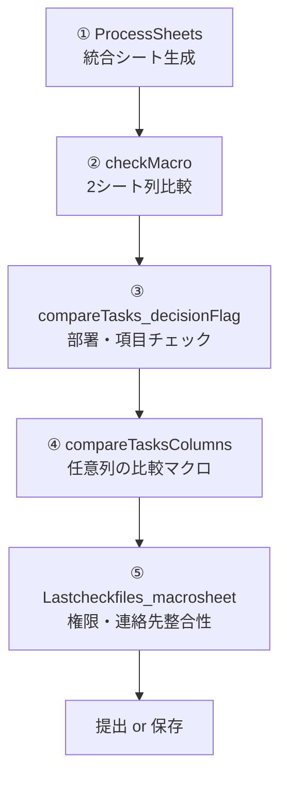
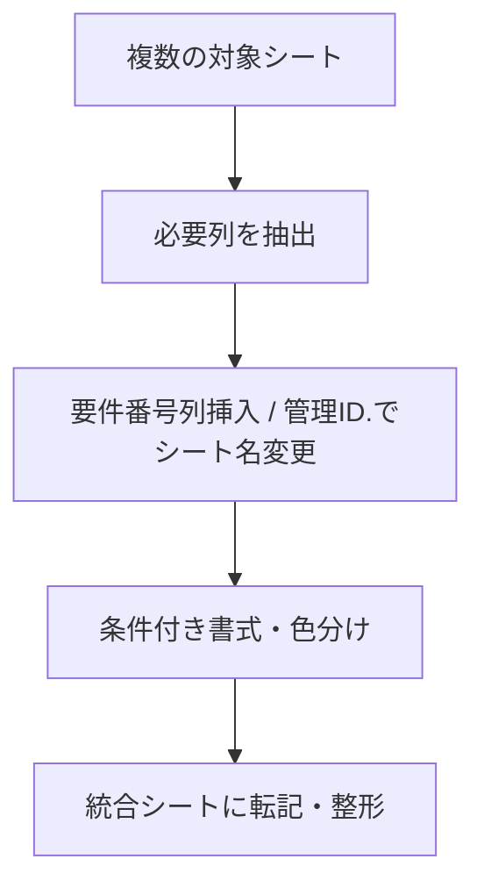
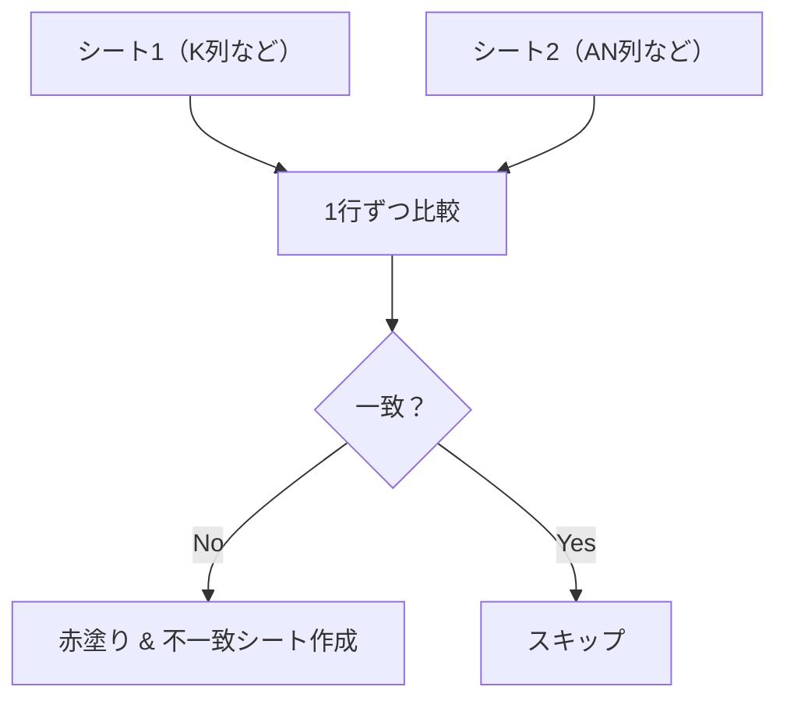
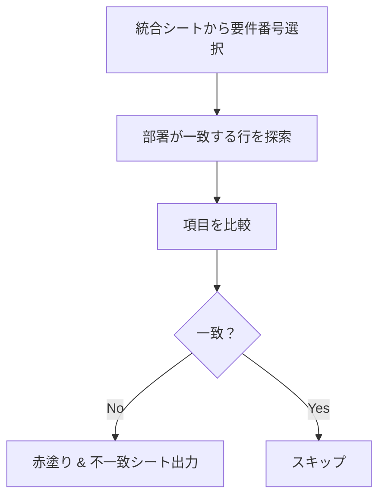
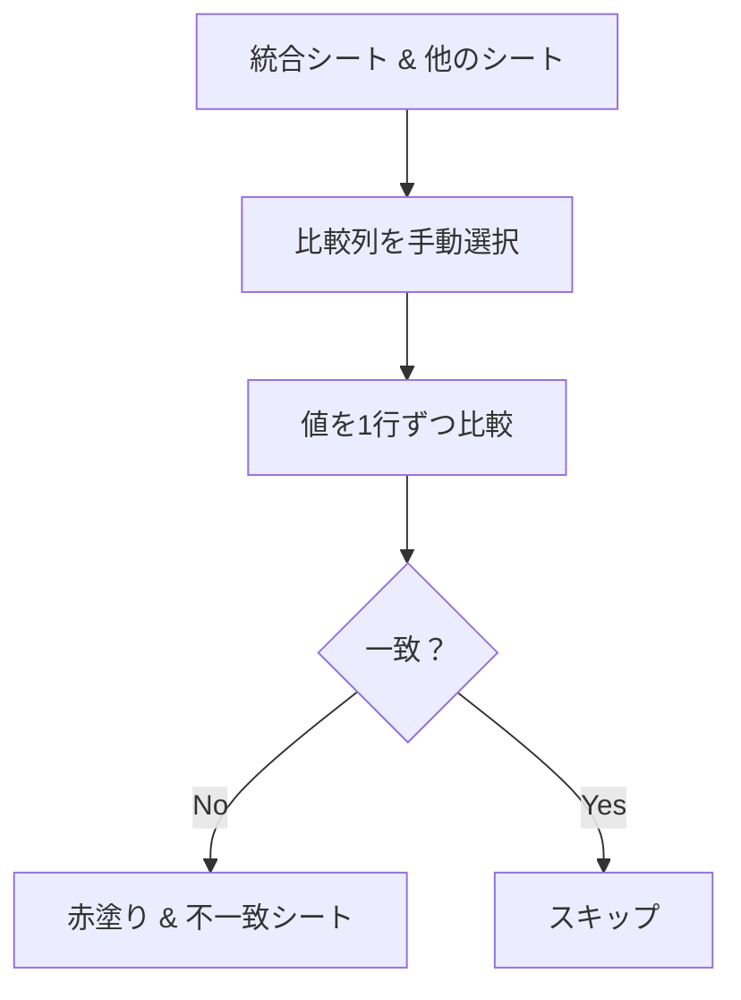
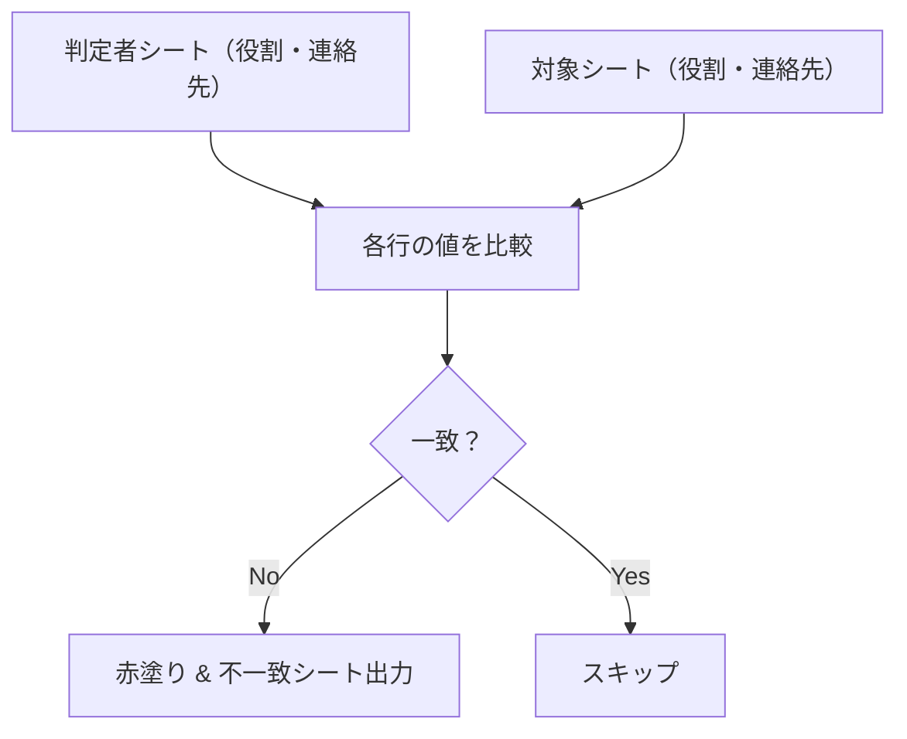

# Excel業務効率化マクロ集（VBA）
このプロジェクトは、日々のExcel業務を効率化するためのVBAマクロ5本をまとめたものです。  
それぞれのマクロは、独立した機能を持ちつつ、組み合わせて使うことで一連の処理を自動化します。
- qiita記事:[https://qiita.com/flopsy_tech/items/1b5675d429c798e29102]

---

## 🧭 目次（Table of Contents）
- [🎯 設計の背景と目的](#🎯-設計の背景と目的)
- [🏢 想定する活用シーン](#🏢-想定する活用シーン)
- [🧠 なぜVBAを選んだか？](#🧠-なぜvbaを選んだか)
- [📘 概要（設計書）](#🏢-📘概要（設計書）)
- [✍️ 制作を通して学んだこと・つまずいた点](#✍️-制作を通して学んだことつまずいた点)
- [📦 構成（マクロの流れと役割）](#📦-構成マクロの流れと役割)
- [📊 マクロ全体の流れ（フローチャート）](#📊-マクロ全体の流れフローチャート)
- [🔧 使用方法](#🔧-使用方法)
- [📸 デモ](#📸-デモ)
- [🔧 開発プロセス](#🔧-開発プロセス)
- [💡 特徴](#💡-特徴)
- [🗂 リポジトリ内ファイル](#🗂-リポジトリ内ファイル)
- [🛡️ ライセンス](#🛡️-ライセンス)
- [🔍 こんなことに少し不安があります…](#🔍-こんなことに少し不安があります)
- [📣 ご覧いただく方へ（レビューしてほしいポイント）](#📣-ご覧いただく方へレビューしてほしいポイント)
- [① 統合シート生成マクロ（ProcessSheets）](#①-統合シート生成マクロprocesssheets)
- [② checkMacro（シート比較マクロ）](#②-checkmacroシート比較マクロ)
- [③ 項目チェックマクロ（compareTasks_decisionFlag）](#③-項目チェックマクロcomparetasks_decisionflag)
- [④ 任意列比較マクロ（compareTasksColumns）](#④-任意列比較マクロcomparetaskscolumns)
- [⑤ 権限・連絡先整合チェックマクロ（Lastcheckfiles_macrosheet）](#⑤-権限連絡先整合チェックマクロlastcheckfiles_macrosheet)

## 🎯 設計の背景と目的

現場では、部品に関する要件情報を複数のExcelシートで管理しており、
それぞれのファイルから情報を転記・集計・確認する作業が属人化していました。

本プロジェクトでは、
- 手作業による転記ミスの防止
- 担当者による処理差の解消
- 進捗状況の一元管理
を目的とし、VBAマクロによる処理の自動化と、運用保守性を考慮した設計書の整備を行いました。

## 🏢 想定する活用シーン
複数部署から提出されたExcelファイルを一括で集計・統合する業務（例：月次レポート、進捗管理）
内容の整合性チェックを複数ファイル・複数条件で行う必要がある業務
最終的に整った提出用フォーマットを作成し、ダブルチェックや手戻りを防ぎたい場面


## 🧠 なぜVBAを選んだか？
Excel業務がベースだったため、Excel上で完結するVBAが最も導入しやすいと判断。
他の言語（Python等）も検討したが、社内PCではインストール制限などがあり、既存環境で動くVBAを優先。
自分自身がExcel VBAを業務で実践していたため、習得コストが最も低く、即戦力になると考えた。
他の方が見ても理解しやすい言語、運用・保守しやすいから。


## 📘 概要（設計書）
本プロジェクトは、Excelファイルにおける**複数シートのデータ整合性チェック**および**進捗管理の自動化**を目的としたVBAマクロ集です。  
属人化を防ぎ、業務チームでも運用できるよう、以下の観点で設計しています。

### 🧩 全体構成
- メインモジュール：`MainModule.bas`
- 入力ファイル：`A要件一覧表.xlsx`, `要件A表.xlsx` など
- 出力ファイル：`進捗集計表.xlsx`
- ボタンUI：Excelリボン or ActiveX ボタンで起動

### ⚙️ 主な機能一覧
| 機能名 | 概要 |
|--------|------|
| データ整合性チェック | A要件一覧と要件A表のID、テスト要否、達成レベルの一致確認 |
| フォーマット自動整形 | 不揃いな表形式を規定のフォーマットに統一 |
| 進捗管理出力 | 各要件の入力状況を一括で抽出し一覧化 |
| 承認用ファイル出力 | 承認に必要な要素のみ抽出して担当者別に整形出力 |

### 📄 設計方針
- **再利用性**：機種や部品が変わっても対応できるよう、パラメータを設定ファイル化
- **ユーザー視点**：ボタン1クリックで操作可能なUI、エラーメッセージの明確化
- **保守性**：コメントによるモジュール説明、エラー処理分離

### 🧑‍🏫 運用マニュアル
- `/docs/manual.md` にマクロの使い方、初期設定、よくあるエラーと対処法を記載予定
- VBA初心者でも使えるように、**画面キャプチャ付きで解説**

### 🔧 保守性への配慮
- 各サブルーチンにコメントを付与し、処理内容と変数の役割を明記
- パスやファイル名など環境依存情報は定数化し、簡単に切り替え可能
- エラー時には `MsgBox` によりユーザーへ内容を通知
- 手動操作を避け、ボタン1クリックで完結するようUIを設計

### 🏗️ 今後の展望（オプション）
- Google Apps Script などへの移植
- Power Query との連携
- GitHub Actions によるマクロ配布の自動化
- 処理構成図やデモを起債予定ですが、実際に使用していたExcelファイルには業務上の機微情報が含まれるため、GitHub上ではサンプルデータの公開は現在は控えています。
必要があれば、面談時にローカル環境にて動作例をご説明可能です。

## ✍️ 制作を通して学んだこと・つまずいた点
処理をサブルーチン単位で整理することで、保守や再利用がしやすくなると実感しました。
ヘッダー行から「管理ID」などの特定ラベルを探す処理は一見シンプルに見えて、実装すると意外と難しく、細かい書式揺れや空白セルに悩まされました。
VBAはちょっとしたミスでも原因の特定に時間がかかることが多く、「1つバグを直すと別のところで新たなエラーが出る」…というデバッグの連鎖にも苦労し、
1日やってても進捗ほとんどないみたいな日があり、悲しくなりましたが、この作業が嫌だというほどではありませんでした。
色判定や入力制限、セルのグループ化など、実務に即したロジックを細かく組み込む過程でたくさんの試行錯誤がありました。
統合シートの整形ルールの標準化にも悩み、何度も実行して確認・修正を繰り返しました。
最終的に全マクロを連携させ、1つの業務フローとして自動化できたときは、達成感と実用的な手応えを得られました。

## 📦 構成（マクロの流れと役割）
| ファイル名（サブルーチン） | 役割 / 使用タイミング | 概要 |
|---------------------------|------------------------|------|
| `ProcessSheets` | 【最初に実行】 | 各シートの必要列を抽出・整形して統合シートを作成。入力制限や色付けも自動で設定 |
| `checkMacro` | 【中間チェック】 | 2つの任意のシートの指定列を比較。不一致セルを赤く塗り、結果を別シートに出力 |
| `compareTasks_decisionFlag` | 【項目内容の一致確認】 | 統合シートと別シート間で、重要な項目内容が一致しているかチェック |
| `compareTasksColumns` | 【中間チェック】 | 統合シートと別シートの任意列を比較マクロ。不一致があれば赤塗り＆詳細出力 |
| `Lastcheckfiles_macrosheet` | 【権限・連絡先整合性確認】 | 参照シートと他のシート間で、役割や連絡先が一致しているかをチェック |


## 📊 マクロ全体の流れ（フローチャート）

 補足：Mermaid記法によるフローチャートは、GitHubの一部UIでは表示されない場合があります。その際は、ローカルで Live Editor をご利用ください。

## 🔧 使用方法
1. Excelで「Alt + F11」を押してVBAエディタを開きます。
2. 「ファイル」→「インポート」で `.bas` ファイルをそれぞれ読み込みます。
3. 実行したいマクロを選んで「F5」キーで実行します。

## 📸 デモ

現在、簡単なデモ動画を準備中です。  
業務効率化の流れが直感的にわかるような内容を予定しています。

## 🛠 開発プロセス
- [#1 入力制限マクロのバグ（部署列が空白の場合落ちる）](https://github.com/flopsy212/excel-check-automation/issues/3)


## 🗂 リポジトリ内ファイル
このリポジトリには、以下のVBAマクロ（`.bas`ファイル）が含まれています：
- `ProcessSheets.bas`
- `checkMacro.bas`
- `compareTasks_decisionFlag.bas`
- `compareTasksColumns.bas`
- `Lastcheckfiles_macrosheet.bas`


## 🛡️ ライセンス
このリポジトリのコードは MIT ライセンスのもとで公開されています。  
商用利用・改変はご自由にどうぞ。

#### 🔍 不安点
- 実際に使ったことのない人でも伝わる構成になっているか
- コードの構造（分割・命名など）が読みやすいか
- ポートフォリオとして伝わりやすい見せ方になっているか

## 📣 ご覧いただく方へ（レビューしてほしいポイント）
このリポジトリは、属人化・ミス・非効率といったExcel業務の課題を感じたことをきっかけに、  
「誰でも正確に処理できるしくみをVBAで構築すること」を目的として作成しました。

転職活動のポートフォリオとしても活用しており、以下の点を意識して設計しています：
- 各マクロが連携し、1つの業務フローとして成り立っている構成
- 初心者にも読みやすいよう、サブルーチンやコメントを工夫した点
- チェック漏れや入力ミスを防ぐための仕組み（色分け、制限、エラー出力など）
特に「構成・実用性・読みやすさ」の観点でフィードバックをいただけると嬉しいです！

> また、今後は「操作ボタン付きテンプレート」や「Python版への展開」も視野に入れています。  
> コメントやIssueでのご意見・アドバイスなども歓迎しています！


---


## ① 統合シート生成マクロ（ProcessSheets）


### 📌 概要
複数のシートを処理し、**必要な情報だけを抽出・整形して「統合」シートに統合**する総合マクロ。業務でよくある「複数ファイル・複数シートの取りまとめ」を自動化することを目的としています。


### 📁 マクロ構成
このプロジェクトは以下のマクロで構成されています：
- `ProcessSheets.bas` : メイン処理（統合シート生成）
- `RenameSheetsBasedOn管理ID.bas` : 管理ID. に基づくシート名変更
- `ProcessSheetColumns.bas` : 不要列削除・要件番号列の整形
- `FormatAndStyleSheet.bas` : 色付けや条件付き書式などの整形
- `InsertFormulasAndFormatting.bas` : 数式の自動挿入と条件付き書式
- `CopyDataToTasks.bas` : 統合シートへの転記処理
- `SetupTasksSheet.bas` : フィルタ・保護・並び替え等の最終整形
- `RestrictInputBasedOnColumns.bas` : 列ごとの入力制限と保護
> すべてのマクロはモジュール単位で `.bas` ファイルとして管理されています。


### 🔍 主な処理内容
- シート名やラベル名をもとに、**必要な列だけを抽出**
- 不要な列を削除、**管理ID.の値でシート名を変更**
- 部署情報の移動や**5列の空列挿入＋グループ化**
- 特定の条件に応じて**色付けや条件付き書式の設定**
- 数式（IF・COUNTIFなど）を自動挿入し、**データの意味づけを支援**
- 最終的に1枚の「統合」シートにまとめて転記・整形
- **入力制限・保護ロジック**も含まれており、誤操作を防止


### ✅ フローチャート
```markdown
### 📈 処理フロー図




### 🧩 使用するサブプロシージャ（構成）
| サブルーチン名 | 処理内容 |
|----------------|----------|
| `ProcessSheets` | メイン処理（全体を統括） |
| `RenameSheetsBasedOn管理ID` | 管理ID. に基づいたシート名変更 |
| `ProcessSheetColumns` | 不要列削除・要件番号追加 |
| `ProcessAdditionalColumns` | 「AHEAD入力可否」や「部署」列の整形 |
| `FormatAndStyleSheet` | ヘッダー設定・背景色・枠線などの整形 |
| `InsertFormulasAndFormatting` | 数式の自動挿入・列の非表示など |
| `CopyDataToTasks` | データの統合（統合シートへ転記） |
| `SetupTasksSheet` | 統合シートの整形・フィルター・保護など |
| `RestrictInputBasedOnColumns` | 入力制限と保護のロジック |


### 🛠 使用方法
1. このプロジェクトの `.bas` ファイルをすべてインポート
2. 「Alt + F8」で `ProcessSheets` を選択して実行
3. 自動的に整形・統合が行われ、「統合」シートが生成されます


### 🎯 活用シーン
- 多数のシートを一括処理し、提出用データを整形したいとき
- 判定や評価情報を一元管理したい業務
- 誤操作防止のために入力制限も組み込みたい業務フロー

---


## ② checkMacro（シート比較マクロ）


#### 📌 概要
2つのExcelシート間で特定の列を比較し、値の不一致を検出します。  
一致しないセルは赤く塗りつぶされ、不一致内容を別シートに出力します。


#### 🔍 主な処理
- 比較元・比較対象のシートをユーザーが選択
- 「管理ID.」というラベルをキーにして比較対象範囲を特定
- 比較対象列もユーザーが選択（手動で指定）
- 背景色がグレーのセルはスキップ
- 値が不一致の場合は、該当セルを赤塗り＋メッセージ表示
- 不一致の詳細を新しいシート「不一致行(チェックマクロ)」に自動出力


#### ✅ フローチャート
```markdown
### 📈 処理フロー図



#### 🛠 使用方法
1. `checkMacro` を実行
2. シート1・シート2を番号で選択（ポップアップあり）
3. 比較対象列はポップアップでの選択または列番号入力で指定（例：B列やP列など）
4. 処理後、不一致がある場合は結果を表示し、新シートに記録されます


#### 📄 出力例
- `不一致行(チェックマクロ)` というシートに、不一致の行が一覧表示されます

---


## ③ 項目チェックマクロ（compareTasks_decisionFlag）


### 📌 概要
「統合」シートと任意のシート間で、**「部署」および「項目」**の内容が一致しているかを比較するマクロです。  
不一致が見つかると該当セルを赤く塗り、詳細を新しいシートに出力します。


### 🔍 主な処理内容
- 「統合」シートにある **要件番号** をユーザーが選択
- 任意の比較対象シート（番号で選択）を指定
- 「部署」列が一致する行同士の「項目」を比較
- 不一致があれば、**シート1・シート2の該当セルを赤塗り**
- 不一致の詳細を「不一致行（項目）」シートに出力


#### ✅ フローチャート
```markdown
### 📈 処理フロー図



### 🛠 使用方法
1. `compareTasks_decisionFlag` を実行
2. ポップアップで要件番号を選択
3. 比較対象となるシート番号を選択
4. 処理が走り、不一致があれば赤く表示され、別シートに出力されます

### 📝 補足
- 部署が一致しない行はスキップされます
- 項目が空白同士なら一致とみなします
- 不一致の記録は「不一致行（項目）」という新しいシートに自動出力されます

---

## ④ 任意列比較マクロ（compareTasksColumns）

### 📌 概要
「統合」シートと他の任意のシート間で、**特定の列の値が一致しているかを最終確認**するマクロです。  
不一致がある場合は該当セルを赤く塗り、別シートに詳細を出力します。

### 🔍 主な処理内容
- ユーザーが比較したいシートを選択（番号入力）
- `管理ID.` の4桁の値をキーとして「統合」シートの対象行を抽出
- 両シートの比較対象列をユーザーが選択（手動で列選択）
- 値が一致しない場合、**セルを赤塗り＆不一致情報をメッセージ表示**
- 不一致行を `不一致行(任意列比較マクロ)` シートに出力

#### ✅ フローチャート
```markdown
### 📈 処理フロー図



### 🛠 使用方法
1. `compareTasksColumns` を実行
2. 比較対象となるシートを番号で選択
3. 比較対象列はポップアップでの選択または列番号入力で指定（例：B列やP列など）
4. 処理後、不一致があればセルが赤く塗られ、別シートに記録されます

## 🔍 `compareTasksColumns` と `checkMacro` の違い

やっている処理が②と④で似ていますが、以下のような違いがあります：
- `checkMacro`：  
　→ **「採否マーク」と「仕向」列のような、判定ルールが厳密な比較**を行いたいときに使用
- `compareTasksColumns`：  
　→ **任意の列で柔軟に突合チェック**したいときに使用（汎用マクロ）

### ✅ 比較表
| 項目 | `compareTasksColumns` | `checkMacro` |
|------|---------------------------|--------------|
| **目的** | 任意の列同士の比較（汎用チェック） | 「採否マーク」と「仕向」のチェックに特化 |
| **シート選択** | 「統合」シートは固定、もう1枚を選択 | 両方のシートをユーザーが選択 |
| **比較対象の列** | 任意の列（ユーザーが選ぶ） | 任意の列（ただし用途は「採否マーク vs 仕向」想定） |
| **セルの色によるスキップ** | なし | グレー・黒セル（入力不要箇所）をスキップ |
| **空白同士の扱い** | 無視（エラー扱いしない） | **エラー扱いして赤く塗る** |
| **不一致のメッセージ** | シンプル（Cell1, Cell2の値） | 詳細付き（白塗りセルで不一致、空白など） |
| **結果出力先シート名** | `不一致行(任意列の比較マクロ)` | `不一致行(チェックマクロ)` |

### 📝 補足
- `管理ID.` の先頭4文字がキーとして使われます。
- シート1（統合）の比較範囲は `A` 列から自動で検出。
- 比較マクロとして、**事前の整形が済んでいる前提**で使用します。

---

## ⑤ 権限・連絡先整合チェックマクロ（Lastcheckfiles_macrosheet）

### 📌 概要
「判定者」シートに記載された **役割と連絡先の組み合わせ** が、他のシートと一致しているかを確認する比較マクロです。  
不一致があれば詳細を別シートに出力します。

### 🔍 主な処理内容
- 「判定者」シートのA列（役割）・B列（連絡先）を対象とする
- ユーザーが比較対象となるシートを選択
- そのシートの中から「役割」「連絡先」列を自動検出
- 2つのシートを**行単位で比較**
- 不一致があれば詳細を **「不一致行（権限・連絡先整合チェックマクロ）」** シートに出力

#### ✅ フローチャート
```markdown
### 📈 処理フロー図



### 🛠 使用方法
1. `Lastcheckfiles_macrosheet` を実行
2. 比較対象のシートを番号で選択
3. 判定が行われ、結果が表示されます

### 📝 補足
- 列名が「役割」「連絡先」である必要があります（全角カナ対応）
- 行数は「判定者」シートと比較対象シートの短い方で揃えられます
- 結果は見やすいテキスト形式で新しいシートに出力されます

---


