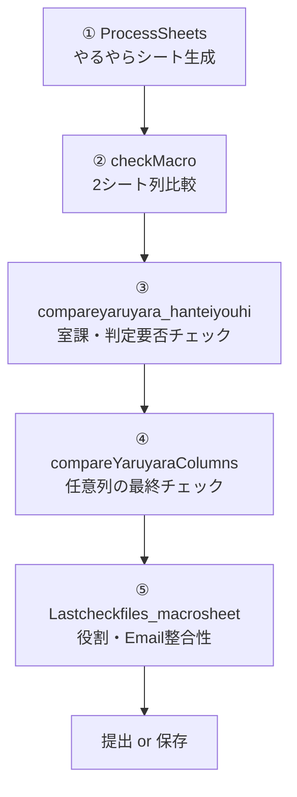
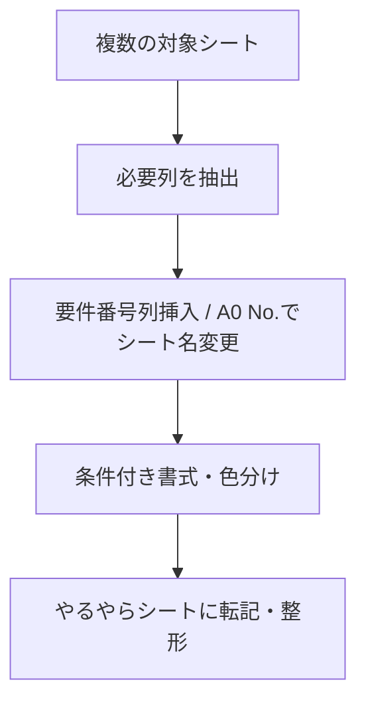
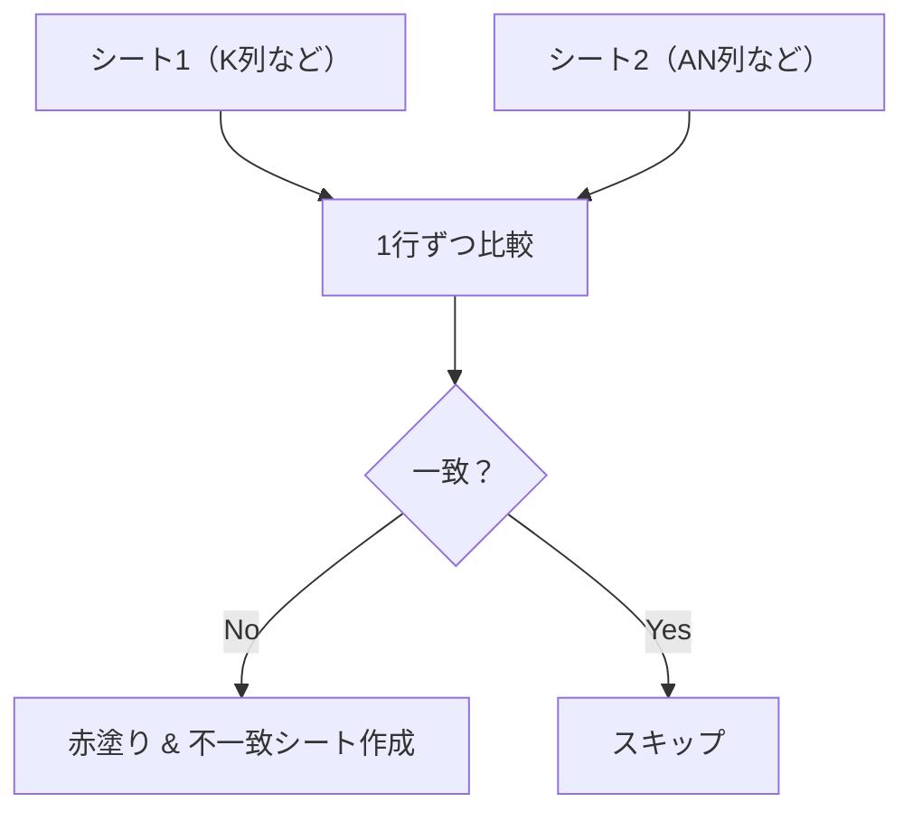
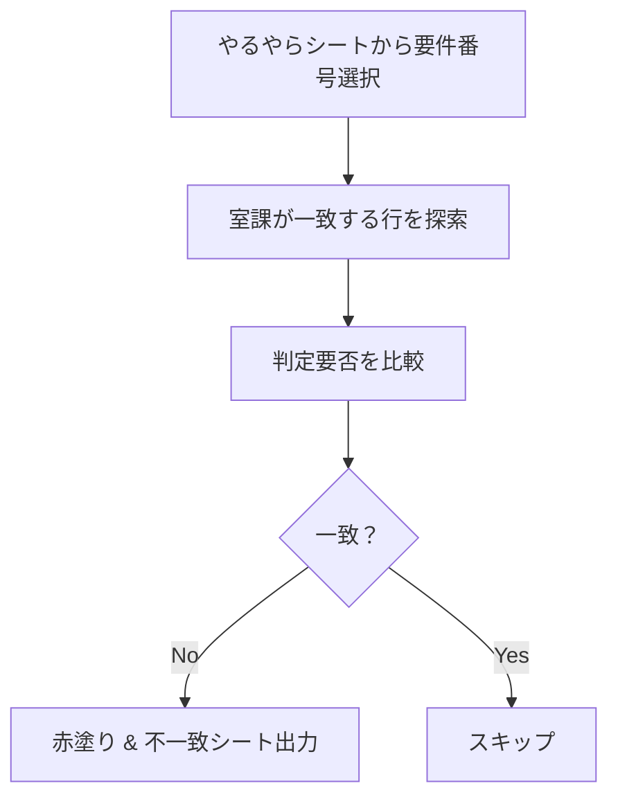
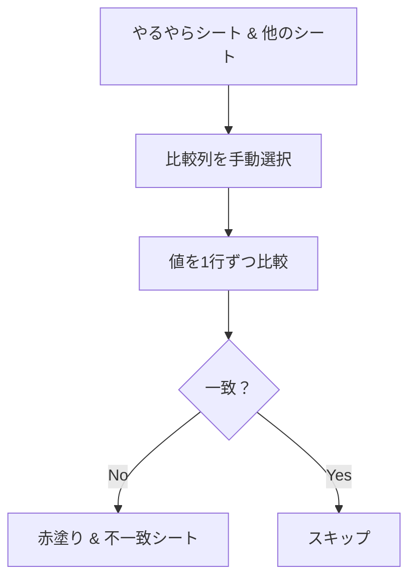
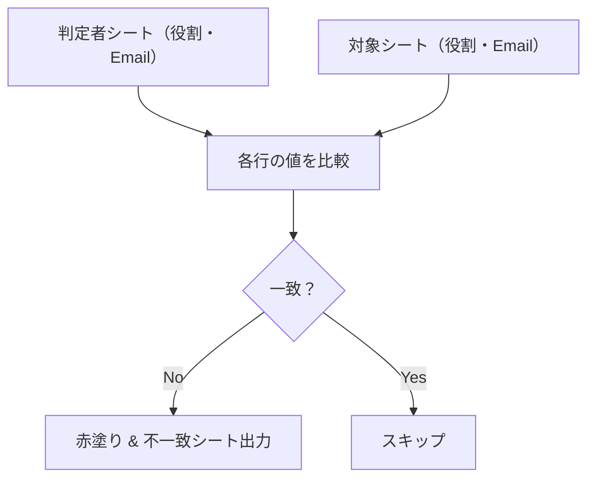

> 🔗 本プロジェクトは、Excel業務を効率化するためのVBAマクロをGitHub上で共有・管理する目的で構築しています。転職活動・スキルポートフォリオとしても活用中。

# Excel業務効率化マクロ集（VBA）
このプロジェクトは、日々のExcel業務を効率化するためのVBAマクロ5本をまとめたものです。  
それぞれのマクロは、独立した機能を持ちつつ、組み合わせて使うことで一連の処理を自動化します。

---

## 🧭 目次
- [構成](#構成)
- [使用方法](#使用方法)
- [特徴](#特徴)
- [① やるやらシート生成マクロ（ProcessSheets）](#①-やるやらシート生成マクロprocesssheets)
- [② checkMacro（シート比較マクロ）](#②-checkmacroシート比較マクロ)
- [③ 判定要否チェックマクロ](#③-判定要否チェックマクロcompareyaruyara_hanteiyouhi)
- [④ 任意列比較マクロ](#④-任意列比較マクロcompareYaruyaraColumns)
- [⑤ 役割・Email整合チェックマクロ](#⑤-役割email整合チェックマクロLastcheckfiles_macrosheet)

## 📦 構成（マクロの流れと役割）
| ファイル名（サブルーチン） | 役割 / 使用タイミング | 概要 |
|---------------------------|------------------------|------|
| `ProcessSheets` | 【最初に実行】 | 各シートの必要列を抽出・整形して「やるやら」シートを作成。入力制限や色付けも自動で設定 |
| `checkMacro` | 【中間チェック】 | 2つの任意のシートの指定列を比較。不一致セルを赤く塗り、結果を別シートに出力 |
| `compareyaruyara_hanteiyouhi` | 【室課・判定要否の一致確認】 | 「やるやら」シートと別シート間で、室課と判定要否の内容が一致しているかチェック |
| `compareYaruyaraColumns` | 【中間チェック】 | 「やるやら」シートと別シートの任意列を最終チェック。不一致があれば赤塗り＆詳細出力 |
| `finalLastcheckfiles_macrosheet` | 【役割・Email整合性確認】 | 判定者シートと他のシート間で、役割とEmailが一致しているかをチェック |

## 📊 マクロ全体の流れ（フローチャート）

 補足：Mermaid記法によるフローチャートは、GitHubの一部UIでは表示されない場合があります。その際は、ローカルで Live Editor をご利用ください。

 ## 📸 デモ（Before / After）
`docs/demo.gif` に、実際の処理の流れをまとめたGIFを用意しています。  
（例：処理前のシート → マクロ実行 → 自動整形後）
> 📄 詳しい使い方は [`docs/使い方ガイド.txt`](docs/使い方ガイド.txt) を参照してください。

## 🔧 使用方法
1. Excelで「Alt + F11」を押してVBAエディタを開きます。
2. 「ファイル」→「インポート」で `.bas` ファイルをそれぞれ読み込みます。
3. 実行したいマクロを選んで「F5」キーで実行します。

## 💡 特徴
- すべてのマクロは1つの業務フローに沿って設計されています。
- 個別に実行することも、まとめて実行することも可能です。
- コメントが丁寧に書かれており、初心者でも読みやすい構成。

## 🗂 リポジトリ内ファイル
このリポジトリには、以下のVBAマクロ（`.bas`ファイル）が含まれています：
- `ProcessSheets.bas`
- `checkMacro.bas`
- `compareyaruyara_hanteiyouhi.bas`
- `compareYaruyaraColumns.bas`
- `Lastcheckfiles_macrosheet.bas`

- ## 🛡️ ライセンス
このリポジトリのコードは MIT ライセンスのもとで公開されています。  
商用利用・改変はご自由にどうぞ。

## 🙋‍♂️ お問い合わせ
本プロジェクトに関する質問・ご連絡は GitHubのIssue または [プロフィールのメールアドレス](https://github.com/あなたのユーザー名) にお願いします。

## 📖 今後の予定
- 各マクロを一つの「操作ボタン付きテンプレート」に統合予定
- GitHub Actionsで自動的に`.bas`ファイルをバックアップする機能の追加


---

## ① やるやらシート生成マクロ（ProcessSheets）

### 📌 概要
複数のシートを処理し、**必要な情報だけを抽出・整形して「やるやら」シートに統合**する総合マクロ。業務でよくある「複数ファイル・複数シートの取りまとめ」を自動化することを目的としています。

### 📁 マクロ構成
このプロジェクトは以下のマクロで構成されています：
- `ProcessSheets.bas` : メイン処理（やるやらシート生成）
- `RenameSheetsBasedOnA0No.bas` : A0 No. に基づくシート名変更
- `ProcessSheetColumns.bas` : 不要列削除・要件番号列の整形
- `FormatAndStyleSheet.bas` : 色付けや条件付き書式などの整形
- `InsertFormulasAndFormatting.bas` : 数式の自動挿入と条件付き書式
- `CopyDataToYaruyara.bas` : やるやらシートへの転記処理
- `SetupYaruyaraSheet.bas` : フィルタ・保護・並び替え等の最終整形
- `RestrictInputBasedOnColumns.bas` : 列ごとの入力制限と保護
> すべてのマクロはモジュール単位で `.bas` ファイルとして管理されています。

### 🔍 主な処理内容
- シート名やラベル名をもとに、**必要な列だけを抽出**
- 不要な列を削除、**A0 No.の値でシート名を変更**
- 室課情報の移動や**5列の空列挿入＋グループ化**
- 特定の条件に応じて**色付けや条件付き書式の設定**
- 数式（IF・COUNTIFなど）を自動挿入し、**データの意味づけを支援**
- 最終的に1枚の「やるやら」シートにまとめて転記・整形
- **入力制限・保護ロジック**も含まれており、誤操作を防止

### ✅ フローチャート
```markdown
### 📈 処理フロー図



### 🧩 使用するサブプロシージャ（構成）
| サブルーチン名 | 処理内容 |
|----------------|----------|
| `ProcessSheets` | メイン処理（全体を統括） |
| `RenameSheetsBasedOnA0No` | A0 No. に基づいたシート名変更 |
| `ProcessSheetColumns` | 不要列削除・要件番号追加 |
| `ProcessAdditionalColumns` | 「AHEAD入力可否」や「室課」列の整形 |
| `FormatAndStyleSheet` | ヘッダー設定・背景色・枠線などの整形 |
| `InsertFormulasAndFormatting` | 数式の自動挿入・列の非表示など |
| `CopyDataToYaruyara` | データの統合（やるやらシートへ転記） |
| `SetupYaruyaraSheet` | やるやらシートの整形・フィルター・保護など |
| `RestrictInputBasedOnColumns` | 入力制限と保護のロジック |

### 🛠 使用方法
1. このプロジェクトの `.bas` ファイルをすべてインポート
2. 「Alt + F8」で `ProcessSheets` を選択して実行
3. 自動的に整形・統合が行われ、「やるやら」シートが生成されます

### 🎯 活用シーン
- 多数のシートを一括処理し、提出用データを整形したいとき
- 判定や評価情報を一元管理したい業務
- 誤操作防止のために入力制限も組み込みたい業務フロー

---

### ② checkMacro（シート比較マクロ）

#### 📌 概要
2つのExcelシート間で特定の列を比較し、値の不一致を検出します。  
一致しないセルは赤く塗りつぶされ、不一致内容を別シートに出力します。

#### 🔍 主な処理
- 比較元・比較対象のシートをユーザーが選択
- 「A0 No.」というラベルをキーにして比較対象範囲を特定
- 比較対象列もユーザーが選択（手動で指定）
- 背景色がグレーのセルはスキップ
- 値が不一致の場合は、該当セルを赤塗り＋メッセージ表示
- 不一致の詳細を新しいシート「不一致行(チェックマクロ)」に自動出力

#### ✅ フローチャート
```markdown
### 📈 処理フロー図



#### 🛠 使用方法
1. `checkMacro` を実行
2. シート1・シート2を番号で選択（ポップアップあり）
3. 比較対象列はポップアップでの選択または列番号入力で指定（例：B列やP列など）
4. 処理後、不一致がある場合は結果を表示し、新シートに記録されます

#### 📄 出力例
- `不一致行(チェックマクロ)` というシートに、不一致の行が一覧表示されます

---

## ③ 判定要否チェックマクロ（compareyaruyara_hanteiyouhi）

### 📌 概要
「やるやら」シートと任意のシート間で、**「室課」および「判定要否」**の内容が一致しているかを比較するマクロです。  
不一致が見つかると該当セルを赤く塗り、詳細を新しいシートに出力します。

### 🔍 主な処理内容
- 「やるやら」シートにある **要件番号** をユーザーが選択
- 任意の比較対象シート（番号で選択）を指定
- 「室課」列が一致する行同士の「判定要否」を比較
- 不一致があれば、**シート1・シート2の該当セルを赤塗り**
- 不一致の詳細を「不一致行（判定要否）」シートに出力

#### ✅ フローチャート
```markdown
### 📈 処理フロー図



### 🛠 使用方法
1. `compareyaruyara_hanteiyouhi` を実行
2. ポップアップで要件番号を選択
3. 比較対象となるシート番号を選択
4. 処理が走り、不一致があれば赤く表示され、別シートに出力されます

### 📝 補足
- 室課が一致しない行はスキップされます
- 判定要否が空白同士なら一致とみなします
- 不一致の記録は「不一致行（判定要否）」という新しいシートに自動出力されます

---

## ④ 任意列比較マクロ（compareYaruyaraColumns）

### 📌 概要
「やるやら」シートと他の任意のシート間で、**特定の列の値が一致しているかを最終確認**するマクロです。  
不一致がある場合は該当セルを赤く塗り、別シートに詳細を出力します。

### 🔍 主な処理内容
- ユーザーが比較したいシートを選択（番号入力）
- `A0 No.` の4桁の値をキーとして「やるやら」シートの対象行を抽出
- 両シートの比較対象列をユーザーが選択（手動で列選択）
- 値が一致しない場合、**セルを赤塗り＆不一致情報をメッセージ表示**
- 不一致行を `不一致行(任意列比較マクロ)` シートに出力

#### ✅ フローチャート
```markdown
### 📈 処理フロー図



### 🛠 使用方法
1. `compareYaruyaraColumns` を実行
2. 比較対象となるシートを番号で選択
3. 比較対象列はポップアップでの選択または列番号入力で指定（例：B列やP列など）
4. 処理後、不一致があればセルが赤く塗られ、別シートに記録されます

### 📝 補足
- `A0 No.` の先頭4文字がキーとして使われます
- シート1（やるやら）の比較範囲は `A` 列から自動で検出
- 最終チェックの目的で使用し、**事前の整形が済んでいることが前提**

---

## ⑤ 役割・Email整合チェックマクロ（Lastcheckfiles_macrosheet）

### 📌 概要
「判定者」シートに記載された **役割とEmailの組み合わせ** が、他のシートと一致しているかを確認する最終チェックマクロです。  
不一致があれば詳細を別シートに出力します。

### 🔍 主な処理内容
- 「判定者」シートのA列（役割）・B列（Email）を対象とする
- ユーザーが比較対象となるシートを選択
- そのシートの中から「役割」「Email」列を自動検出
- 2つのシートを**行単位で比較**
- 不一致があれば詳細を **「不一致行（ファイナル最終）」** シートに出力

#### ✅ フローチャート
```markdown
### 📈 処理フロー図



### 🛠 使用方法
1. `Lastcheckfiles_macrosheet` を実行
2. 比較対象のシートを番号で選択
3. 判定が行われ、結果が表示されます

### 📝 補足
- 列名が「役割」「Email」である必要があります（全角カナ対応）
- 行数は「判定者」シートと比較対象シートの短い方で揃えられます
- 結果は見やすいテキスト形式で新しいシートに出力されます

---


